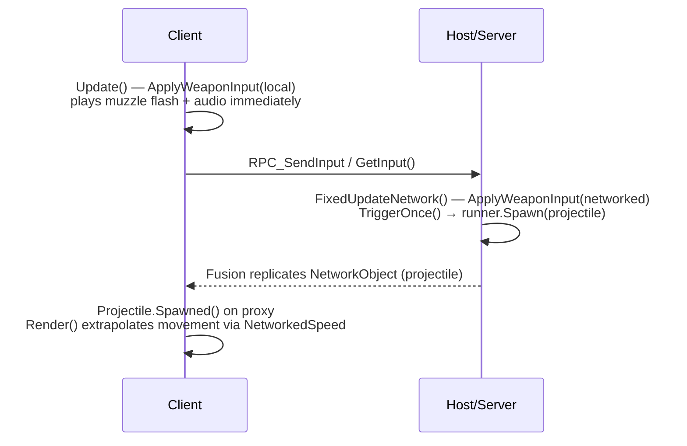

# Prototype_GV2 — Projectile & Weapon Network Sync Notes

This document captures all bugs found, root causes, and code changes made to fix multiplayer weapon synchronization.

---

## System Overview

| Layer | Component | Role |
|---|---|---|
| **Input** | `NetworkedPlayerInput.cs` | Reads Unity Input System; serializes as `PlayerInputData` |
| **Bridge** | `NetworkedSpaceshipBridge.cs` | Feeds engine + weapon input; handles client prediction |
| **Weapons** | SCK `TriggerablesManager` | Routes trigger indices → specific weapons |
| **Launcher** | `ProjectileWeaponUnit.cs` | Spawns projectile via Fusion `runner.Spawn()` on Host |
| **Projectile** | `Projectile.cs` / `RigidbodyProjectile.cs` | `NetworkBehaviour`; moves via `FixedUpdateNetwork` on Host |
| **Missiles** | `MissileCycleControllerDynamic.cs` | `NetworkBehaviour`; tracks ammo via `NetworkArray` |
| **Aim** | `AimController.cs` + `CustomCursor.cs` | Calculates world-space aim direction from camera + cursor |

---

## Bugs Fixed

### 1. Double Audio on Firing

**Root Cause:**
`ProjectileWeaponUnit.TriggerOnce()` always invoked `onProjectileLaunched`, which triggers `AudioSpawner.SpawnAll`. This ran on **both** the local client (from `ApplyWeaponInput` in `Update`) **and** the Host authority (from `FixedUpdateNetwork`), resulting in two audio events.

**Fix — `ProjectileWeaponUnit.cs`:**
```csharp
// Only invoke events (audio, muzzle flash) if we are the authority or the shooter.
// This prevents proxy ships from duplicating the firing audio.
NetworkObject netObj = rootTransform.GetComponentInParent<NetworkObject>();
if (runner == null || !runner.IsRunning || netObj == null || netObj.HasStateAuthority || netObj.HasInputAuthority)
{
    onProjectileLaunched.Invoke(projectileController); // or null for clients
}
```

---

### 2. Client Cannot Fire Missiles (CanTriggerWeapon Fails)

**Root Cause:**
`MissileCycleControllerDynamic` was syncing `NetworkedAmmoCounts` → `ResourceContainer` only inside `Render()`. However, `Render()` runs **after** `FixedUpdateNetwork`, so when the client locally predicted a missile fire, `CanTriggerWeapon()` checked the stale/zero ammo count and aborted.

**Fix — `MissileCycleControllerDynamic.cs`:**
Moved the ammo-sync logic from `Render()` into `FixedUpdateNetwork()` on the client branch so it runs before input is evaluated:

```csharp
public override void FixedUpdateNetwork()
{
    if (Object.HasStateAuthority)
    {
        // Host: Write current ammo to NetworkedAmmoCounts
        for (int i = 0; i < missileMounts.Count; i++) { ... }
    }
    else
    {
        // Client: Sync NetworkedAmmoCounts → local ResourceContainer
        // BEFORE input processing so CanTriggerWeapon() passes!
        for (int i = 0; i < missileMounts.Count; i++) { ... }
    }
}
```

---

### 3. Client Projectiles Fire Backward (on Host Screen)

**Root Cause:**
`WeaponsController` calls `gunWeapon.Aim(aimPosition)` → `ProjectileWeaponUnit.spawnPoint.LookAt(aimPosition)`. The `aimPosition` comes from `AimController`, which reads direction from a `CustomCursor`. On the **Host**, the Client's proxy ship has no active camera, so `CustomCursor.AimDirection` returns `-cursorRectTransform.forward` (negative/backward).

**Fix 1 — `AimController.cs`:**
```csharp
// Only use cursor if it's actually active (has a camera)
if (cursor != null && cursor.gameObject.activeInHierarchy)
    aim.direction = cursor.AimDirection;
```

**Fix 2 — `NetworkedSpaceshipBridge.cs` (`DisableLocalInput()`):**
```csharp
// Disable CustomCursor on remote ships so they don't force weapons to aim backward!
var cursors = GetComponentsInChildren<VSX.Utilities.CustomCursor>(true);
foreach (var cursor in cursors)
{
    cursor.gameObject.SetActive(false);
}
```

---

### 4. Client Cannot See Their Own Projectiles

**Status: FIXED**

**Root Cause (two parts):**

**Part A — Speed:** `NetworkedSpeed` was 0 on the proxy at spawn time. The host set `NetworkedSpeed = speed` inside `Projectile.Spawned()`, but Fusion takes the initial `[Networked]` property snapshot **at object creation time**, before `Spawned()` runs. So the proxy's first snapshot contained `NetworkedSpeed=0`. `Render()` translated by `0 * deltaTime = 0`.

**Part B — Position:** Even after fixing speed, the proxy position was `(0,0,0)`. Without a `NetworkTransform` component, Fusion does **NOT** replicate the `position`/`rotation` parameters of `runner.Spawn()` to proxies. The proxy just instantiates the prefab at its default transform origin. The projectile was flying from world origin, far from the ship.

**Fix — `ProjectileWeaponUnit.cs`:**
Used Fusion's `onBeforeSpawned` callback to set ALL critical `[Networked]` properties before the first snapshot:
```csharp
var networkObject = runner.Spawn(projectilePrefab, spawnPos, spawnRot, runner.LocalPlayer,
    onBeforeSpawned: (runner, obj) =>
    {
        var proj = obj.GetComponent<Projectile>();
        if (proj != null)
        {
            proj.NetworkedSpeed = finalSpeed;
            proj.NetworkedMaxDistance = finalMaxDistance;
            proj.NetworkedDamageMultiplier = damageMultiplier;
            proj.NetworkedHealingMultiplier = healingMultiplier;
            proj.NetworkedSpawnPosition = spawnPos;    // NEW
            proj.NetworkedSpawnRotation = spawnRot;    // NEW
        }
    });
```

**Fix — `Projectile.cs`:**
- Added `[Networked] NetworkedSpawnPosition` and `[Networked] NetworkedSpawnRotation` properties.
- `Spawned()` (proxy branch): Applies `transform.position = NetworkedSpawnPosition` and `transform.rotation = NetworkedSpawnRotation` before anything else, so the proxy starts at the gun position, not `(0,0,0)`.
- `Spawned()` (authority branch): Only sets defaults if `onBeforeSpawned` didn't already set them (checks `== 0`).
- `Render()`: Syncs `speed = NetworkedSpeed` if it arrives late. Added first-render diagnostic log.

---

## Files Modified

### GV (Custom Scripts)

| File | Key Change |
|---|---|
| [NetworkedSpaceshipBridge.cs](file:///c:/Users/Veera/Desktop/Unity/GitHub/Prototype_GV2/Assets/GV/Scripts/Network/NetworkedSpaceshipBridge.cs) | Disabled `CustomCursor` on proxy ships; `ApplyWeaponInput` gating by authority; client-side prediction setup |
| [MissileCycleControllerDynamic.cs](file:///c:/Users/Veera/Desktop/Unity/GitHub/Prototype_GV2/Assets/GV/Scripts/MissileCycleControllerDynamic.cs) | Moved ammo sync from `Render()` → `FixedUpdateNetwork()` |
| [NetworkedPlayerInput.cs](file:///c:/Users/Veera/Desktop/Unity/GitHub/Prototype_GV2/Assets/GV/Scripts/Network/NetworkedPlayerInput.cs) | Fixed `NotifyInputConsumed` resetting buttons prematurely |

### SCK (Space Combat Kit — Modified)

| File | Key Change |
|---|---|
| [ProjectileWeaponUnit.cs](file:///c:/Users/Veera/Desktop/Unity/GitHub/Prototype_GV2/Assets/SpaceCombatKit/VSXPackageLibrary/Packages/WeaponsSystem/Scripts/GunWeapons/ProjectileWeapons/ProjectileWeaponUnit.cs) | Authority check before `onProjectileLaunched` (prevents double audio on proxies) |
| [Projectile.cs](file:///c:/Users/Veera/Desktop/Unity/GitHub/Prototype_GV2/Assets/SpaceCombatKit/VSXPackageLibrary/Packages/WeaponsSystem/Scripts/GunWeapons/ProjectileWeapons/Projectile.cs) | Added `[Networked]` speed/distance vars; proxy movement simulation in `Render()` |
| [RigidbodyProjectile.cs](file:///c:/Users/Veera/Desktop/Unity/GitHub/Prototype_GV2/Assets/SpaceCombatKit/VSXPackageLibrary/Packages/WeaponsSystem/Scripts/GunWeapons/ProjectileWeapons/RigidbodyProjectile.cs) | Proxy physics simulation in `FixedUpdate()` |
| [AimController.cs](file:///c:/Users/Veera/Desktop/Unity/GitHub/Prototype_GV2/Assets/SpaceCombatKit/VehicleCombatKits/Scripts/AimController.cs) | Added `activeInHierarchy` check to prevent backward aim |

---

## Architecture: Who Does What



**Key rule:** Only the **Host** spawns projectiles via Fusion. Clients see them via replication and move them in `Render()` since `FixedUpdateNetwork` doesn't run on proxies without state authority.

---

## Trigger Index Mapping (TriggerablesManager)

| Index | Weapon |
|---|---|
| `0` | Primary Fire (Laser Guns) — Left Mouse Button |
| `1` | Secondary Fire — Middle Mouse Button |
| `2` | Missile Fire — Right Mouse Button |

Missile mounts are forced to `DefaultTriggerIndex = 2` in `MissileCycleControllerDynamic.Start()`.

---

## Known Remaining Issues

- None at present. All previously known issues have been resolved.
